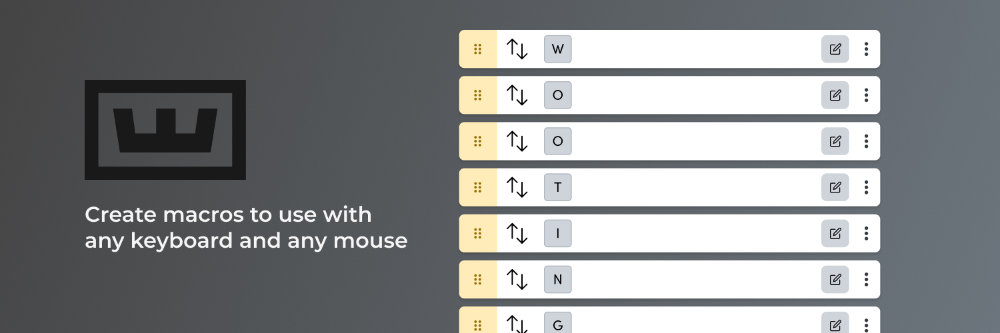
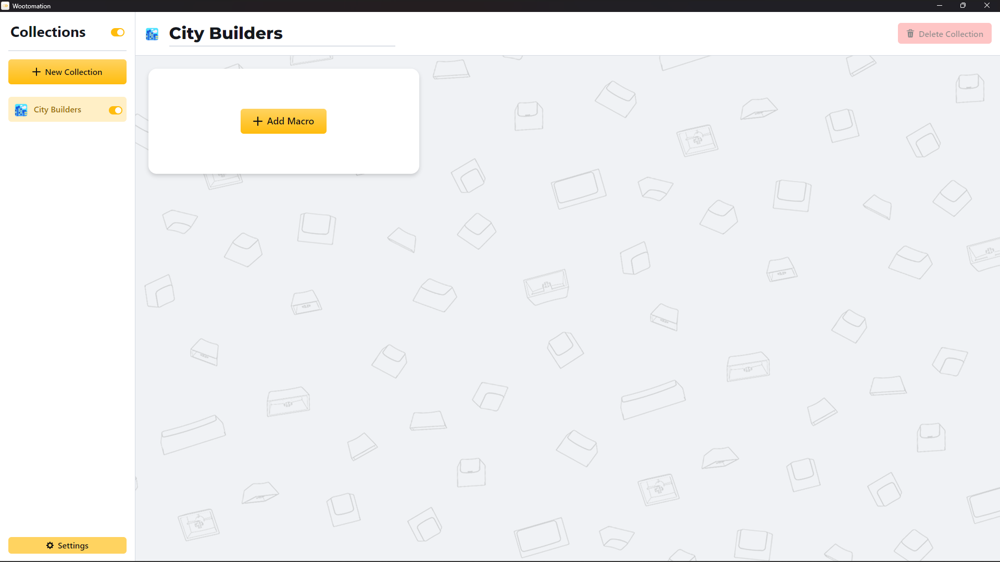
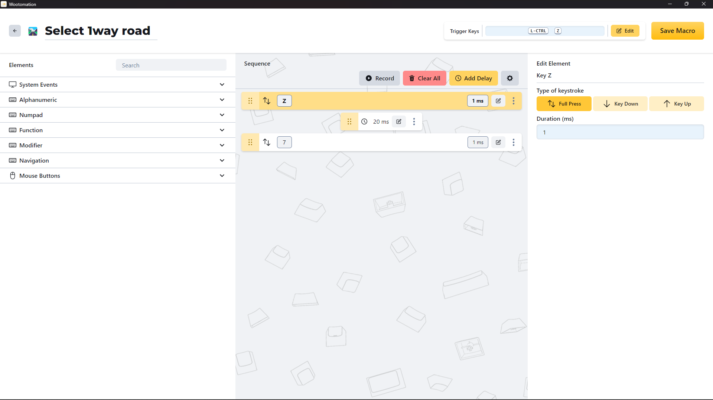
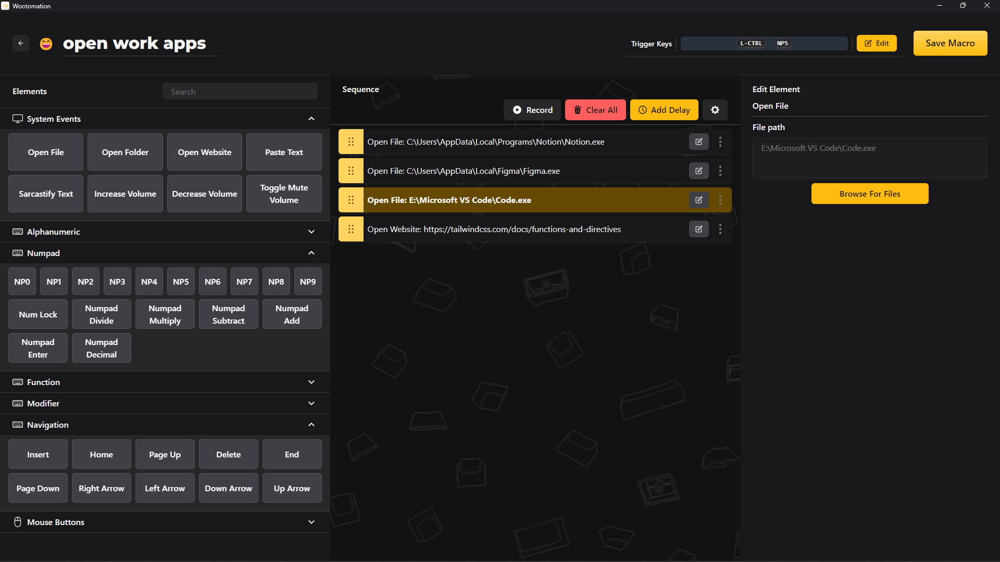

# Wootomation

  

## Features

- **Create Macros:** Perform keystrokes, open applications, folders, and websites, paste text with emojis, and more.
- **Organize your macros:** Group macros into specific collections, allowing you to toggle the entire collection on/off.
- **Any Keyboard, Any Mouse:** You can bind the macros to be activated by any keyboard key or mouse button*.
- **Open Source:** Want to help out? See below on how to get started.
- **Windows & Linux:** Support for Windows 10/11 and most Linux distros**. MacOS support is on our radar.

*Mice with more than 5 buttons may experience unintended behaviour. Please report any issues on the [Discord](https://discord.gg/wooting)!

**Linux is supported, but may be unstable with Wayland. Different DEs and distributions may result in various bugs - please report them. Some input latency may be introduced on Linux due to the scheduler. You can increase the niceness of the process manually to eliminate it.

## Warnings

**Please do be aware that this application does grab and analyze keystrokes. While you are able to disable this temporarily using an appropriate function, you should still not have this application running alongside games (use at your own risk!). Macros (depending on how you configure them) are considered cheating.**

## Installing the App
Download the [Latest Release here](https://github.com/WootingKb/wooting-macros/releases/latest)

For MS Windows, download the MSI and then run it to install the application.

For Linux, download the AppImage or .deb and install the application.

## Contributing

Interested in contributing? We have some [contributing guidelines](./CONTRIBUTING.md) to help you out.

## Screenshots

  
  
  

## License

This project is licensed under the GNU GENERAL PUBLIC LICENSE Version 3  - see the [LICENSE](LICENSE) file for details.
