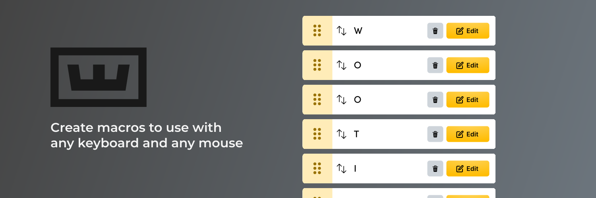

<p align="center">
  
</p>

<p align="left">
  <a href="https://twitter.com/intent/follow?screen_name=WootingKB">
    
  </a>
</p>

## Features
- **Create Macros:** perform keystrokes, open applications, folders, and websites, paste text with emojis, and more.
- **Organize your macros:** group macros into specific collections, allowing you to toggle the entire collection on/off.
- **Any Keyboard, Any Mouse:** you can bind the macros to be activated by any keyboard key or mouse button.
- **Open Source:** want to help out? See below on how to get started.

## Table of Contents
- Installing the App
- Documentation
- Contributing

## Installing the App
For windows, download the latest release's msi and install the application.

For linux, download the latest release's AppImage or deb and install the application.

## Documentation
N/A

## Contributing
The project runs with a Rust backend and React frontend (TS), with Tauri connecting the two.

Dependencies
- Rust
- Node.js (^18)
- Yarn
- [Tauri's prequisites](https://tauri.app/v1/guides/getting-started/prerequisites/)

What we'd like the community to focus on is implementing plugins that allow a user to add specific actions to their macro sequences. E.g. Controlling smart lights brightness, colour, etc.

This entails adding to both the backend and frontend. In the backend, you would add the logic required for the actions to work. In the frontend, you would simply update the necessary UI and maps that would render for a user.

You can always open an issue if you encounter any problems. Looking to add something you created? If it's a small change (i.e. text change or bug fix) feel free to open a PR anytime. If you want to add a feature, please open an issue to discuss with the community first.

## Building
Firstly run yarn to install all the dependencies
```
yarn
```

### Devving
First start the dev server which watches for changes and recompiles
```
yarn tauri dev
```

### Deploying
Make a production build of all the code
```
yarn tauri build
```
